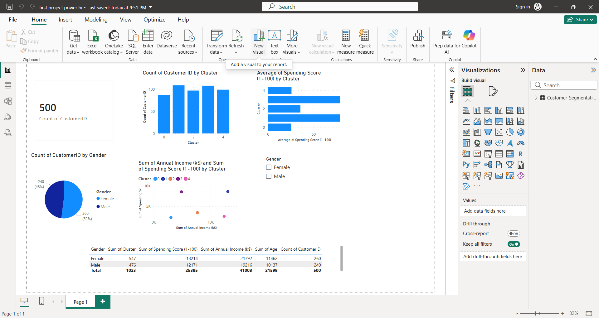

# Customer Segmentation using K-Means Clustering and Power BI Dashboard

--> Project Description
This project analyzes mall customer data using Machine Learning. The customer data is processed in Google Colab using Python. Data cleaning, exploratory data analysis (EDA), and K-Means Clustering are performed to group customers based on their Annual Income and Spending Score. The clustered data is then exported as a CSV file and imported into Power BI to create an interactive dashboard for business analysis.

--> Project Objective
To identify different customer groups so that businesses can better understand customer behavior and create targeted marketing strategies.

--> Tools and Technologies
- Python
- Google Colab
- Pandas
- NumPy
- Matplotlib
- Seaborn
- Scikit-learn
- Power BI

--> Machine Learning Algorithm
- K-Means Clustering

--> Dashboard Features
- Total Customers
- Gender Distribution
- Customers by Cluster
- Annual Income vs Spending Score
- Average Spending Score by Cluster
- Gender Filter
- Customer Details Table

--> Project Workflow
Mall_Customers.csv
      ↓
Google Colab (Python + EDA + K-Means)
      ↓
Customer_Segmentation_Result.csv
      ↓
Power BI Dashboard

--> Result
The project successfully segments customers into different groups based on their income and spending patterns. The interactive Power BI dashboard helps visualize these segments and supports business decision-making. 

--> Dashboard Preview

